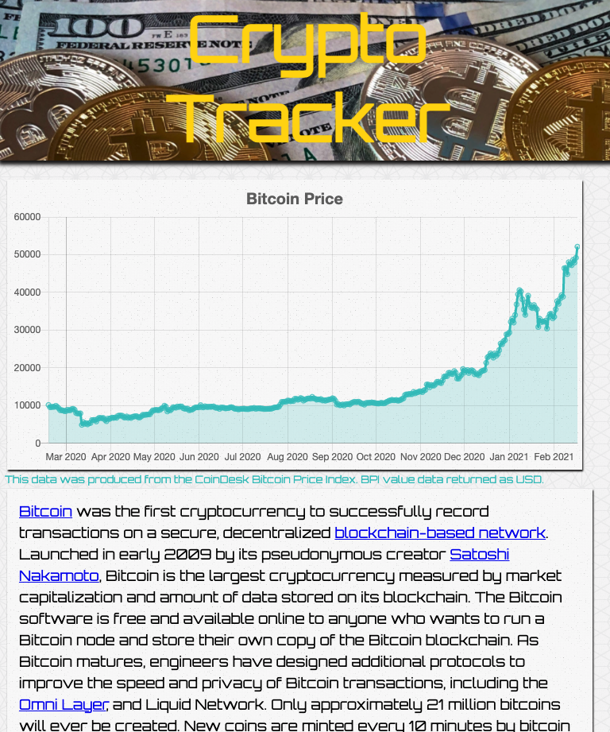

# Crypto-Tracker-Tool
MiniApps fullstack practice #2. Build a single-page app for viewing the historical price data for any cryptocurrency.

# Requirements
Starting from scratch (blank index.html, blank app.jsx and blank server.js files), build a single-page app for viewing the historical price data for any cryptocurrency.

> Use:
ReactJS for all views and bundle with Webpack
Express to serve your app and all its assets
The CoinDesk API  to retrieve all your data
ChartJS.org to display your time-series  charts
Start building your app using a single, fixed currency symbol, Bitcoin (BTC), and a fixed date range of your choosing. Use a time-series chart and show closing prices only.

> Reminder:
Emphasis should be placed on creating well-defined interfaces, writing code with a clear separation of concerns, and using the principles of modularity, encapsulation, abstraction.

# Set Up
> Run the following commands from the root of this repository
```
npm i
```
```
npm run build
```
```
npm start
```

# Final Product


